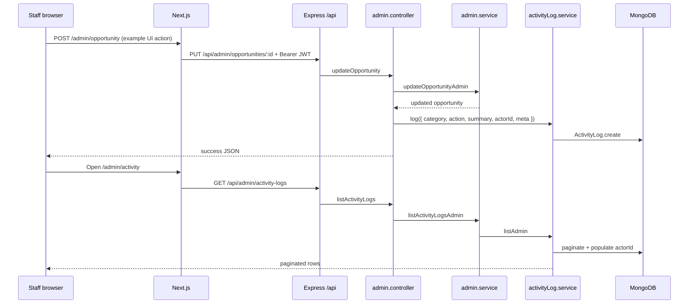

# Staff admin portal and activity log — architecture and behavior

This document describes how the **staff (admin) area** of Red Dog Radios is wired end to end: Next.js routes and layouts, shared UI components, the authenticated HTTP client, Express admin API routes, JWT protection, and the **ActivityLog** audit trail (schema, writes, list/detail APIs, and UI).

---

## 1. Purpose at a glance

| Layer | Purpose |
|--------|---------|
| **Staff UI** (`/admin/*`) | Internal tools for Red Dog staff: dashboard, agencies, opportunities, funders, applications, users, settings, and an **Activity** screen that reads immutable audit entries. |
| **`adminApi`** | Axios instance that talks to the backend under `/api/...`, attaches the staff JWT, and clears session on `401`. |
| **`AdminAuthProvider`** | Holds staff user + token in memory and `localStorage`; sets a cookie for the token; ensures only `role === "admin"` is treated as signed in. |
| **`AdminShell`** | Wraps all panel pages: enforces login redirect, renders sidebar/header via `AppShellLayout`, and handles dev-only chunk-load recovery. |
| **`/api/admin` (Express)** | All staff-only REST endpoints; most routes use `protectAdmin` so only JWTs for users with `role: 'admin'` succeed. |
| **Activity logs** | MongoDB documents recording *who did what* for key staff actions (opportunities, funders, matches, AI regeneration, user roles, deletes, etc.). |

Agency-facing routes and tokens are separate; staff sign-in clears agency session keys to avoid mixing contexts.

---

## 2. HTTP path: browser → API

1. The Next.js app serves pages from the frontend dev server.
2. `next.config.ts` rewrites **`/api/:path*`** → **`http://localhost:4000/api/:path*`** (backend). In production you would point this at your deployed API host.
3. Frontend code uses `adminApi` with `baseURL: "/api/"`, so a call like `adminApi.get("admin/activity-logs")` becomes **`GET /api/admin/activity-logs`** on the backend.
4. Express mounts admin routes at **`app.use('/api/admin', adminRoutes)`** in `app.js`.

---

## 3. Authentication

### 3.1 Backend: `protectAdmin`

- Reads `Authorization: Bearer <jwt>`.
- Verifies JWT with `process.env.JWT_SECRET`.
- Loads `User` by `decoded.id`.
- Requires **`user.role === 'admin'`**; otherwise responds with a staff-only error (`403`).
- Sets **`req.user`** for controllers/services.

Unauthenticated or invalid tokens yield `401`.

### 3.2 Login endpoint (no `protectAdmin`)

- **`POST /api/admin/auth/login`** — body: email/password; uses shared auth service `loginAdmin`. Returns `{ user, token }` inside the standard success payload.
- **`GET /api/admin/auth/me`** — `protectAdmin`; returns `req.user` (current staff profile).

### 3.3 Frontend: `AdminAuthContext`

- **Storage keys:** `rdg_admin_token`, `rdg_admin_user` (JSON).
- **Cookie:** `rdg_admin_token` is set on login (7-day `max-age`) and cleared on logout; useful if any server/middleware path needs the token (the primary client usage is `localStorage` + axios header).
- **Hydration:** On mount, reads storage; if stored user’s `role` is not `"admin"`, storage is cleared.
- **`isAuthenticated`:** `true` only when both a token and an admin user exist.
- **`login`:** Refuses non-admin roles; clears **agency** session (`rdg_token`, `rdg_user`, related cookies) so staff and agency sessions do not overlap.
- **`logout`:** Clears staff token, user, and cookie.

### 3.4 Frontend: `adminApi` interceptors

- **Request:** If `window` is defined, reads `rdg_admin_token` and sets `Authorization: Bearer ...`.
- **Response (401):** Removes staff token/user from storage, clears admin cookie, and redirects to `/admin/login` (unless already there).

---

## 4. Next.js App Router structure (`src/app/admin`)

### 4.1 `layout.tsx` (admin root)

- Wraps **all** `/admin` routes with **`AdminAuthProvider`**.
- Effect: login page and panel share the same auth context.

### 4.2 `page.tsx` (admin index)

- Server component that **`redirect("/admin/dashboard")`** — `/admin` has no standalone UI.

### 4.3 `login/page.tsx`

- **Client component** staff sign-in form (`react-hook-form` + zod).
- **`POST admin/auth/login`** via `adminApi`; on success calls `login(user, token)` then **`window.location.assign("/admin/dashboard")`** (full navigation to refresh layout state).
- Does **not** use `AdminShell` (no sidebar); only the root layout’s provider.

### 4.4 Route group `(panel)/layout.tsx`

- Wraps authenticated panel routes with **`AdminShell`**.
- Any URL under `(panel)` gets the staff chrome (nav, header, logout) and the auth gate inside `AdminShell`.

### 4.5 Panel routes (each `page.tsx`)

These are the main staff screens (all under `(panel)` unless noted):

| URL | Typical role |
|-----|----------------|
| `/admin/dashboard` | KPIs, recent signups, top matched opportunities, recent application activity (from application data, not necessarily `ActivityLog`). |
| `/admin/activity` | Paginated-style list of **`ActivityLog`** documents (see §6–§7). |
| `/admin/activity/[id]` | Single log entry with full summary, actor, and JSON **meta**. |
| `/admin/agencies`, `/admin/agencies/[id]` | Active organizations list and detail (matches, applications, history). |
| `/admin/opportunities`, `new`, `[id]`, `[id]/edit` | CRUD and detail for grant opportunities. |
| `/admin/funders`, `new`, `[id]`, `[id]/edit` | Funder directory management. |
| `/admin/applications`, `[id]` | Application pipeline for staff. |
| `/admin/users`, `[id]` | User list and detail; role updates. |
| `/admin/settings` | Staff settings view. |
| `/admin/matches` | Exists in the tree for match management UI (nav item may or may not be present depending on `AdminShell` menu config). |

Exact UI behavior on each page is implemented in its respective `page.tsx` and any imported views; this doc focuses on **shared patterns** and **activity** in depth.

---

## 5. Shared components

### 5.1 `AdminShell` (`components/admin/AdminShell.tsx`)

**Purpose:** Application shell for every `(panel)` page.

**Behavior:**

1. **`useAdminAuth()`** — if not authenticated, **`router.replace("/admin/login")`** and show “Checking session…”.
2. **Dev-only chunk error recovery** — listens for `ChunkLoadError` / failed dynamic import; once per cooldown, reloads the page so stale caches after deploy recover.
3. **`AppShellLayout`** — receives:
   - **`menuItems`:** `ADMIN_MENU` (Dashboard, Activity, Agencies, Opportunities, Funders, Applications, Users, Settings) with paths and icon assets.
   - **`activePathMatchesPrefix: true`** — so e.g. `/admin/agencies/xyz` highlights “Agencies”.
   - **`user`** derived from admin context (email, names).
   - **`onLogout`**, **`signOutRedirectPath="/admin/login"`**, **`headerSubtitle="Staff portal"`**.
4. **Content area** — padded container wrapping `{children}` (each page’s markup).

### 5.2 `AppShellLayout` (`components/AppShellLayout.tsx`)

**Purpose:** Reusable sidebar + header + mobile menu; used by staff portal and can be used elsewhere.

**Notable contract:**

- **`activePathMatchesPrefix`** — when true, active nav item matches exact path or any nested path (`pathname.startsWith(itemPath + '/')`).
- Renders branding, navigation links, user block, logout, optional Ashleen chat (`showAshleen` — staff shell does not enable it by default in `AdminShell`).

### 5.3 `AdminBackLink` (`components/admin/AdminBackLink.tsx`)

**Purpose:** Consistent ghost **back** control with arrow icon.

- Uses `Button` + `next/link`.
- Activity detail page uses it to return to `/admin/activity`.

### 5.4 `AdminTableViewLink` (`components/admin/AdminTableViewLink.tsx`)

**Purpose:** Compact **eye** icon link for table rows (accessible via `aria-label`).

- Activity list uses it for **`/admin/activity/:id`** with label `"View log entry"`.

---

## 6. Activity log — data model

### 6.1 Mongoose schema (`activityLog.schema.js`)

| Field | Type | Purpose |
|--------|------|---------|
| `category` | `enum` | Groups events: `opportunity`, `funder`, `application`, `match`, `ai`, `user`, `system`. |
| `action` | `string` | Machine-friendly action name (e.g. `created`, `updated`, `recompute_all`). |
| `summary` | `string` | Human-readable one-line description for tables and notifications. |
| `severity` | `enum` | `info` (default), `warning`, `error` — for future filtering or styling. |
| `actorId` | `ObjectId` → `User` | Staff user who triggered the action (optional in schema but usually set for staff-driven events). |
| `meta` | `Mixed` | Arbitrary JSON (IDs, counts, payloads) for detail view and integrations. |
| `createdAt` / `updatedAt` | auto | From `{ timestamps: true }`. |

**Indexes:** `createdAt` descending for efficient “latest first” queries.

**Pagination:** `mongoose-paginate-v2` plugin on the model.

### 6.2 Service (`activityLog.service.js`)

| Function | Purpose |
|----------|---------|
| **`log({ category, action, summary, severity, actorId, meta })`** | Creates a row. Failures are **swallowed** (logged with `logger.warn`) so audit write errors do not break primary business transactions. |
| **`listAdmin({ page, limit, category })`** | Paginates with optional `category` filter, sort `createdAt` desc, **`populate('actorId', 'email firstName lastName')`**. Cap: `limit` max **100**. |
| **`getByIdAdmin(id)`** | Loads one doc with same actor populate; throws **`AppError` 404** if missing. |

---

## 7. When are activity logs written?

Writes go through **`activityLogService.log(...)`** from **`admin.controller.js`** (and **`admin.service.js`** for deletes where logging belongs next to the destructive operation).

**Examples (non-exhaustive; see controller for full set):**

| Trigger | category | action (typical) |
|---------|-----------|-------------------|
| Create/update opportunity | `opportunity` | `created` / `updated` |
| Delete opportunity | `opportunity` | `deleted` (from service after `remove`) |
| Create/update funder | `funder` | `created` / `updated` |
| Delete funder | `funder` | `deleted` |
| Admin creates application for agency | `application` | `created_for_agency` |
| Regenerate application AI | `ai` | `application_regenerate` |
| Recompute all matches | `match` | `recompute_all` (meta includes counts) |
| Approve/reject match | `match` | `approved` / `rejected` |
| Update user role | `user` | `role_updated` |

**Not every admin read or minor edit may be logged** — the pattern is to log meaningful mutations and high-impact operations.

---

## 8. Backend admin routes (`admin.route.js`)

Base path: **`/api/admin`**.

| Method | Path | Middleware | Controller | Purpose |
|--------|------|------------|------------|---------|
| POST | `/auth/login` | — | `adminLogin` | Staff JWT login |
| GET | `/auth/me` | `protectAdmin` | `adminMe` | Current user |
| GET | `/dashboard` | `protectAdmin` | `dashboard` | Aggregated stats |
| GET | `/activity-logs` | `protectAdmin` | `listActivityLogs` | Paginated logs |
| GET | `/activity-logs/:id` | `protectAdmin` | `getActivityLog` | One log |
| GET | `/agencies` | `protectAdmin` | `listAgencies` | Agencies list |
| GET | `/agencies/:id` | `protectAdmin` | `getAgency` | Agency detail |
| GET/POST/PUT/DELETE | `/opportunities` … | `protectAdmin` | various | Opportunity admin CRUD |
| GET/POST/PUT/DELETE | `/funders` … | `protectAdmin` | various | Funder admin CRUD |
| GET/POST/PUT | `/applications` … | `protectAdmin` | various | Applications + status + AI |
| GET/POST/PUT | `/matches` … | `protectAdmin` | various | List, recompute, approve/reject |
| GET/PUT | `/users` … | `protectAdmin` | `listUsers`, `getUser`, `updateUserRole` | User admin |

**List endpoints** that use **`paginate()`** respond with:

```json
{
  "success": true,
  "message": "...",
  "data": [ /* docs */ ],
  "pagination": {
    "total", "page", "limit", "totalPages", "hasNextPage", "hasPrevPage"
  }
}
```

**Single-resource** endpoints use **`success(res, data)`** → `{ success, message, data }`.

---

## 9. Admin service delegation (`admin.service.js`)

`admin.service` is the **orchestration layer** for staff operations:

- **Dashboard:** Runs parallel Mongo aggregations/queries (counts, recent orgs, top opportunities by high match scores, application status breakdown, “recent activity” derived from **application `statusHistory`**, etc.). Note: that dashboard “recent activity” is **not** the same collection as `ActivityLog`; it is application-centric timeline data.
- **CRUD:** Delegates to domain services (`oppService`, `funderService`, `appService`, `matchService`) where possible.
- **Activity log reads:** `getActivityLogAdmin` → `activityLogService.getByIdAdmin`; `listActivityLogsAdmin` → `activityLogService.listAdmin`.
- **Match recompute:** Nested loops over active orgs × all opportunities, `computeMatchScore`, upsert `Match`, update org `lastMatchRecomputedAt` / `matchCount`.

---

## 10. Activity UI — list page (`(panel)/activity/page.tsx`)

**Type:** Client component (`"use client"`).

**Data:** `@tanstack/react-query` with key `["admin", "activity-logs", category]`.

**Request:** `GET admin/activity-logs` with `params: { limit: 100, page: 1, category? }`.

**State:**

- **`category`** — string; empty means “all”. Changing it changes the query key and refetches.

**UI pieces:**

- Title and short explanation (staff-only audit trail).
- **Category `<select>`** — options align with schema enums (including `system`).
- **Refresh** button — `refetch()` without remounting.
- **Table:** When, Category (badge), Action, Summary (truncated with `title` tooltip), link column with **`AdminTableViewLink`** → `/admin/activity/[id]`.
- **Footer note:** Explains follow-up emails / outbox behavior (product context, not stored in ActivityLog).

**Note:** The UI currently requests **page 1** and **limit 100** only; pagination metadata from the API is not yet wired to “next page” controls. Extending the page would use `pagination` from the response and additional state for `page`.

---

## 11. Activity UI — detail page (`(panel)/activity/[id]/page.tsx`)

**Type:** Client component.

**Routing:** `useParams().id` — supports string or array segment normalization.

**Request:** `GET admin/activity-logs/:id` with query key `["admin", "activity-log", id]`; **`enabled: Boolean(id)`**.

**Loading / error:** Loading text; “not found” on error or missing data.

**Display:**

- **`AdminBackLink`** → `/admin/activity`.
- Heading: category · action.
- Fields: timestamp, category, action, severity (default `info`), **actor** (from populated `actorId`: name or email).
- Full **summary** (`whitespace-pre-wrap`).
- **Meta:** If `meta` has keys, pretty-printed JSON in a scrollable `<pre>`.

---

## 12. How the pieces fit together (activity flow)



---

## 13. File reference (primary paths)

| Area | Path |
|------|------|
| Admin routes | `red-dog-radios-backend/src/modules/admin/admin.route.js` |
| Admin controller | `red-dog-radios-backend/src/modules/admin/admin.controller.js` |
| Admin service | `red-dog-radios-backend/src/modules/admin/admin.service.js` |
| Activity log model | `red-dog-radios-backend/src/modules/activityLogs/activityLog.schema.js` |
| Activity log service | `red-dog-radios-backend/src/modules/activityLogs/activityLog.service.js` |
| Admin JWT middleware | `red-dog-radios-backend/src/middlewares/adminAuth.middleware.js` |
| App mount | `red-dog-radios-backend/src/app.js` (`/api/admin`) |
| Admin layout / auth | `red-dog-radios-frontend/src/app/admin/layout.tsx` |
| Panel shell | `red-dog-radios-frontend/src/app/admin/(panel)/layout.tsx` |
| Activity list | `red-dog-radios-frontend/src/app/admin/(panel)/activity/page.tsx` |
| Activity detail | `red-dog-radios-frontend/src/app/admin/(panel)/activity/[id]/page.tsx` |
| `AdminShell` | `red-dog-radios-frontend/src/components/admin/AdminShell.tsx` |
| `adminApi` | `red-dog-radios-frontend/src/lib/adminApi.ts` |
| `AdminAuthContext` | `red-dog-radios-frontend/src/lib/AdminAuthContext.tsx` |
| API rewrite | `red-dog-radios-frontend/next.config.ts` |

---

## 14. Operational notes

- **JWT secret** must match between token issuance (`loginAdmin`) and `protectAdmin`.
- **CORS** is configured in `app.js`; frontend must be allowed if API is on another origin (rewrites hide this in local dev).
- **Activity log write failures** are non-fatal by design; monitor `[ActivityLog] write failed` warnings if audit completeness is critical.
- Extending audit coverage: call **`activityLogService.log`** from the appropriate controller (or service, for deletes) with stable **`action`** strings and structured **`meta`** for the detail screen.

This document reflects the codebase structure and behavior as implemented; individual list/detail pages for agencies, applications, etc., can be documented the same way by reading their `page.tsx` files and the matching `admin.service` functions.
